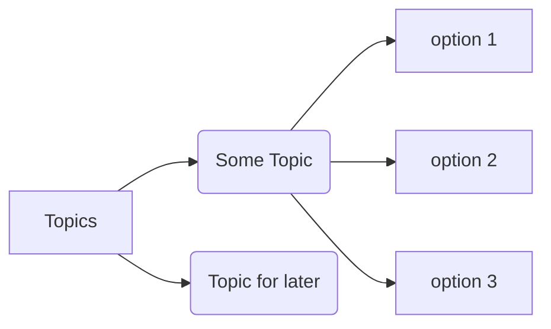

## TLDR

A voting app

## Notes
1. The Vote.csproj file (along with appsettings.json) will need to be created locally if you are going to clone this.  Using net7.0!

## Flow Chart

```mermaid
flowchart LR
Topics-->topic1(Some Topic)
Topics-->topic2(Topic for later)
topic1--> a[option 1]
topic1--> b[option 2]
topic1--> c[option 3]

```