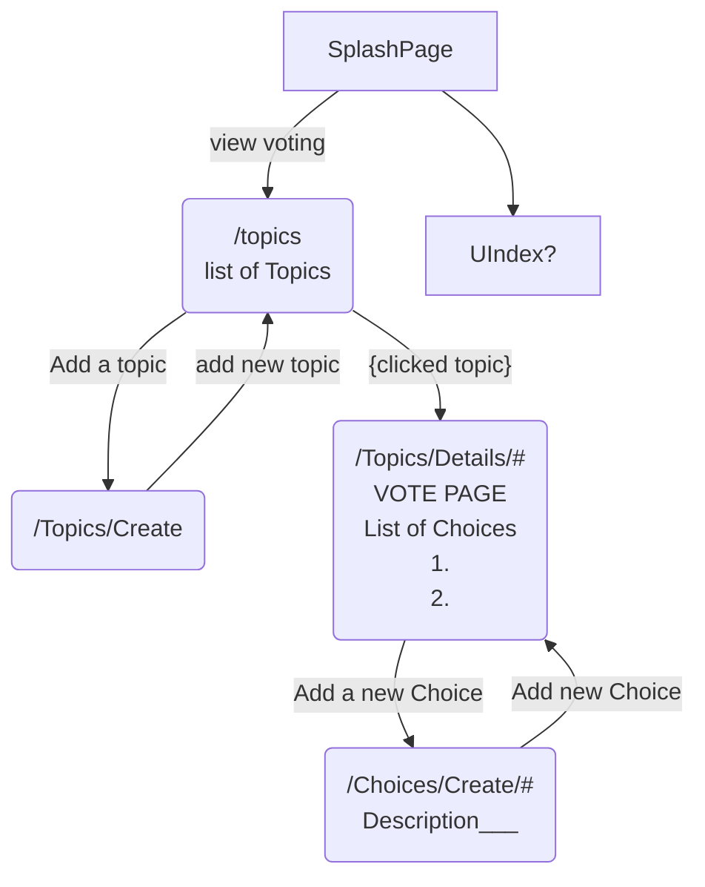

# UI Flow Chart



<!-- ```mermaid
flowchart TB
WizeVote-->TC(TopicsController)
WizeVote-->HC(HomeController)
WizeVote-->CC(ChoicesController)
HC-->I("Index() splash page")
TC-->TI("Index()")
TC-- sdf ---TDet(details)
CC-->CI("Index()")


``` -->
## TLDR

A voting app

## Notes
1. The Vote.csproj file (along with appsettings.json) will need to be created locally if you are going to clone this.  Using net7.0!


## Flow Chart

<!-- 
```mermaid
flowchart LR
Topics-->topic1(Some Topic)
Topics-->topic2(Topic for later)
topic1--> a[choice 1]
topic1--> b[choice 2]
topic1--> c[choice 3]

``` -->
